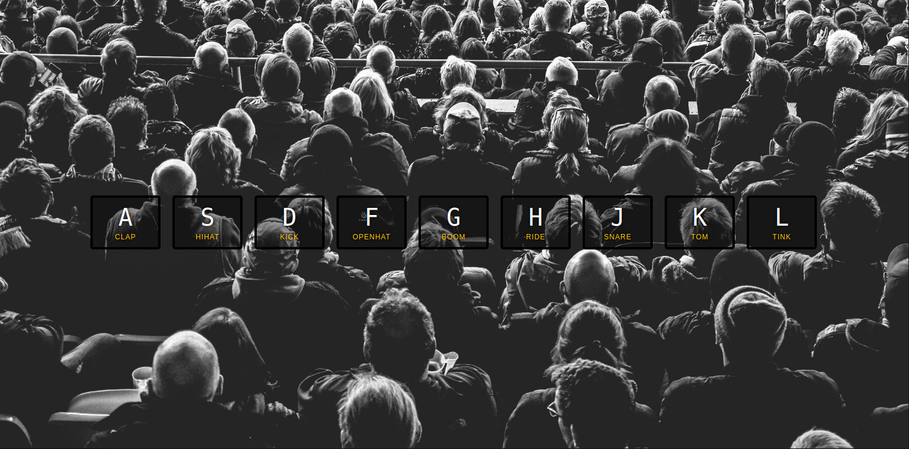

# 01-JavaScript Drum Kit

This is a JavaScript practice for the [#JavaScript30](https://javascript30.com/) created by [Wes Bos](https://github.com/wesbos), the challenge is to create 30 things in 30 days just with Vanilla JS

## Overview

### About this project

Create a drum kit in JS with events on the keyboard.

### Screenshot

### Links

- Live Site URL: 

### What I learned

- Data -* property
- Keyboard events - Key code
- Transitionend in the addEventListener
- Audio play

### Useful resources

- [HTML data -* Attribute](https://www.w3schools.com/TAGS/att_data-.asp)
- [HTML DOMS Events](https://www.w3schools.com/jsref/dom_obj_event.asp)
- [Key Code Website](https://www.toptal.com/developers/keycode)