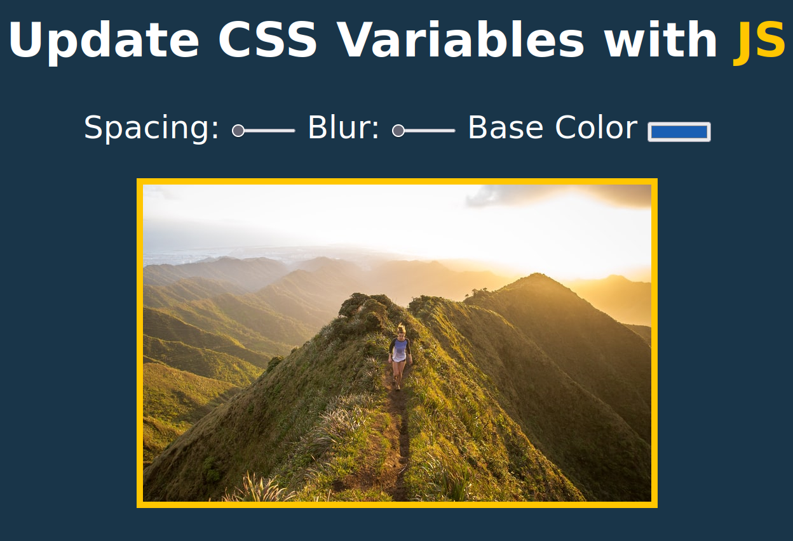

# 03-CSS-Variables

This is a JavaScript practice for the [#JavaScript30](https://javascript30.com/) created by [Wes Bos](https://github.com/wesbos), the challenge is to create 30 things in 30 days just with Vanilla JS

## Overview

### About this project

Add functionality to inputs by using CSS variables and giving them functionality through JavaScript.

### Screenshot

### Links

- Live Site URL: [CSS-Variables-JS](https://03-css-variables.netlify.app/)

### What I learned

- :root property
- dataset
- how to interact with different inputs through JavaScript

### Useful resources

- [:root](https://developer.mozilla.org/en-US/docs/Web/CSS/:root)
- [HTMLElement.dataset](https://developer.mozilla.org/en-US/docs/Web/API/HTMLElement/dataset)
- [CSS filter Property](https://www.w3schools.com/cssref/css3_pr_filter.asp)