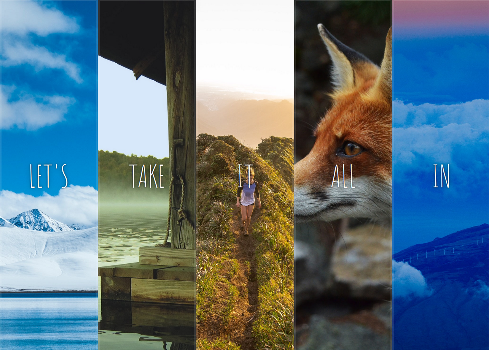
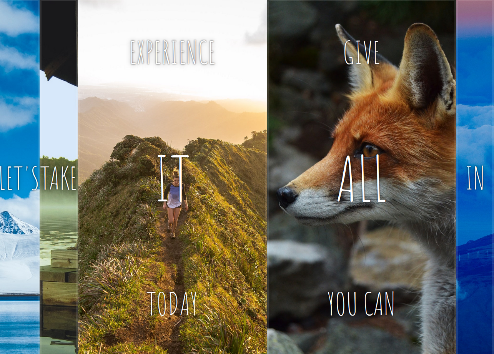

# 05-Flex Panels Image Gallery

This is a JavaScript practice for the [#JavaScript30](https://javascript30.com/) created by [Wes Bos](https://github.com/wesbos), the challenge is to create 30 things in 30 days just with Vanilla JS

## Overview

### About this project

Create a gallery of image panels and give them animations with CSS properties and adding functionality via JavaScript

### Screenshots

### Links

- Live Site URL: [Flex Panels Image Gallery](https://js30panel-image-gallery.netlify.app/)

### What I learned

- Interact with click and transitionend events
- Performing different forms of animations through CSS